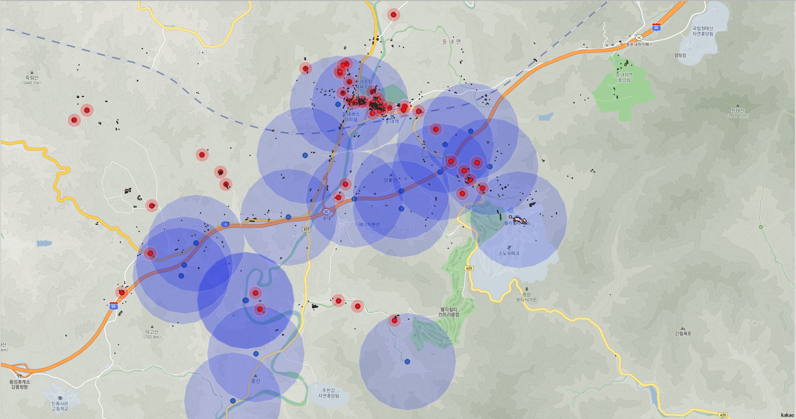

# 강원도소방용수시설 최적입지 분석

<div align="center">
    
  
</div>

##  About <a name = "about"></a>


##  Project structure

```
Location-Selection-for-Firefighting-water-facility
 ┣ analysis
 ┃ ┣ 데이터전처리 - SGGEMD.ipynb
 ┃ ┣ 분석.ipynb
 ┃ ┗ 지도 시각화.ipynb
 ┣ data
 ┃ ┣ preprocessed data
 ┃ ┣ qgis data
 ┃ ┗ raw data
 ┣ img
 ┣ shp
 ┣ project(최종).qgz
 ┣ README.md
 ┣ 강원소방용수시설 최적입지 분석(최종).pdf
 ┗ 최종보고서.pdf
```
##  Dataset  
<div>


</div>

## Result

```
강원도소방용수시설 최적입지
1순위 삼척시 하장면 
2순위 횡성군 둔내면    
3순위 정선군 남면  
4순위 영월군 주천면   
5순위 강릉시 왕산면 
```
<div align=center>


</div>


##  ✍️ Authors
 ``곽명빈`` [@ Myungbin](https://github.com/Myungbin?tab=repositories)